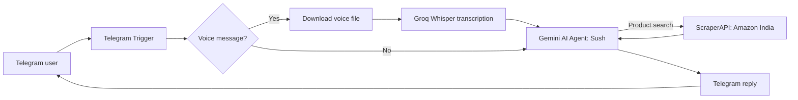

# Sush — Voice-Enabled Telegram AI Shopping & Styling Assistant

Sush is an n8n-powered Telegram assistant that helps users discover products on Amazon India and get personalised styling advice through text and voice messages.

> **Prototype notice:** Built and tested with free-tier services; API availability may be limited.

## Demo

Watch the recorded walkthrough: [Sush-TelegramBot-demo.mp4](https://github.com/Sushmithadyapa/sush-telegram-ai-shopping-assistant/releases/download/v1.0.0/Sush-TelegramBot-demo.mp4) 

## What it does

- Receives text and voice messages through Telegram
- Transcribes voice notes with Groq Whisper
- Uses a Gemini-powered n8n AI Agent for shopping and styling conversations
- Searches Amazon India through ScraperAPI for product requests
- Returns product suggestions or personalised styling guidance through Telegram

## Architecture

## Tech stack

n8n · Telegram Bot API · Google Gemini · Groq Whisper · ScraperAPI · Python

## Run it yourself

1. Import [TelegramBot.sanitized.json](TelegramBot.sanitized.json) into n8n.
2. Connect your own Telegram, Groq, Gemini, and ScraperAPI credentials.
3. Replace `YOUR_SCRAPERAPI_KEY` with your own secure credential.

## Security

The included workflow has had API keys, credentials, webhook identifiers, and instance metadata removed.
