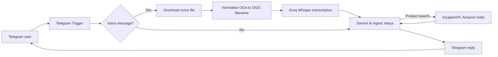

# Sush — Voice-Enabled Telegram AI Shopping & Styling Assistant

Sush is an n8n-powered Telegram assistant that helps users discover products on Amazon India and get personalised styling advice. It accepts both text and voice messages, turns voice messages into text, and responds directly in Telegram.

> **Prototype notice:** This project was built and tested with free-tier services, so API usage and availability may be limited.

## Demo

Watch the recorded walkthrough: [`Sush-TelegramBot-demo.mp4`](Sush-TelegramBot-demo.mp4)

## What it does

- Receives text and voice messages through a Telegram bot
- Downloads and transcribes voice messages with Groq Whisper
- Uses a Gemini-powered n8n AI Agent for shopping and styling conversations
- Searches Amazon India through ScraperAPI when the user requests products
- Returns concise product results or personalised styling guidance to Telegram

## Architecture

## Tech stack

| Area | Tools |
| --- | --- |
| Workflow automation | n8n |
| Conversational interface | Telegram Bot API |
| Voice transcription | Groq Whisper (`whisper-large-v3-turbo`) |
| AI model | Google Gemini |
| Product retrieval | ScraperAPI + Amazon India |
| Message processing | n8n Code node (Python) |

## Example interactions

**Product discovery**

> Find running shoes under ₹2,000

Sush searches Amazon India and returns up to five real products with their names, prices, ratings, and links.

**Styling advice**

> How should I style a blue kurti for a casual outing?

Sush asks for context when useful, then suggests outfit combinations, footwear, accessories, and practical styling tips.

## Run it yourself

1. Import [`TelegramBot.sanitized.json`](TelegramBot.sanitized.json) into your own n8n instance.
2. Create and connect your own Telegram, Groq, Google Gemini, and ScraperAPI credentials in n8n.
3. Replace `YOUR_SCRAPERAPI_KEY` in the ScraperAPI HTTP Request node with your own key, preferably through an n8n credential or environment variable.
4. Activate the workflow and message your Telegram bot.

## Security

The included workflow is a safe-to-share export. Personal credential references, webhook identifiers, instance metadata, and API keys have been removed. Never commit Telegram bot tokens, API keys, credential exports, or real execution data.

## Project highlights

- Designed an end-to-end conversational automation rather than a standalone chatbot.
- Implemented a separate voice-processing path with file handling and transcription.
- Used tool-aware AI-agent behavior to distinguish product search from styling consultation.
- Tested the automation under free-tier API/token constraints.

## Future improvements

- Add product filters for brand, delivery location, and budget range.
- Preserve conversation context across Telegram messages.
- Add result caching and fallback providers for API-limit resilience.
- Deploy monitoring and user-feedback collection for a production version.

## Author

Built as a personal automation project. Feedback and suggestions are welcome.
